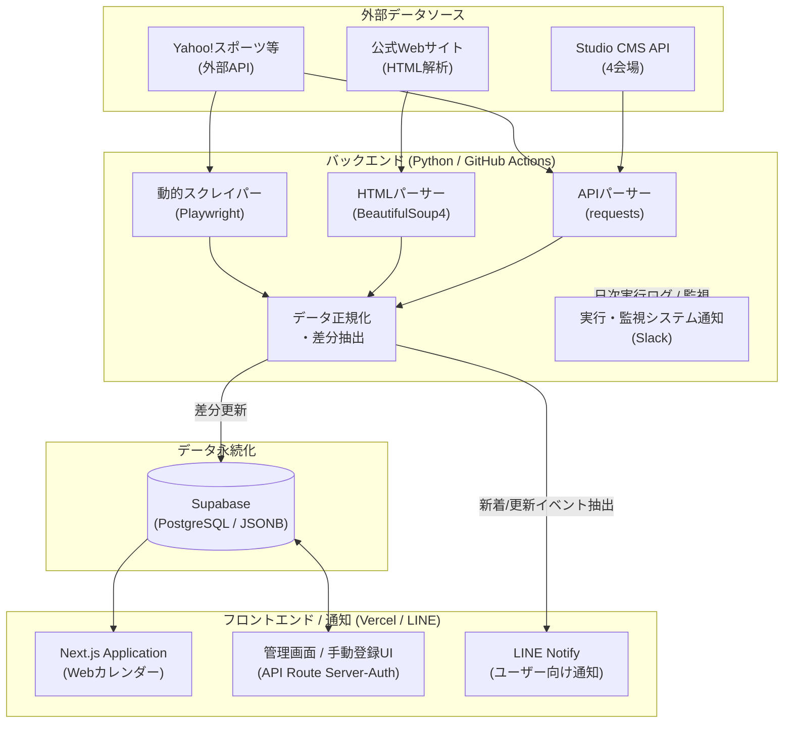

# 福岡イベント自動通知・カレンダーシステム アーキテクチャ概要

本ドキュメントは、福岡市内の主要イベント会場のスケジュールを自動巡回・蓄積し、LINE/Slackへの通知およびWebカレンダーとして公開するための「フルスタック自動化システム」の全体仕様とアーキテクチャをまとめたものです。
（※セキュリティのため、APIキーやWebhook URL、データベース接続情報等は秘匿しています。）

---

## 🚀 システムの概要

**「毎日自動的に各会場の最新イベント情報を集め、手元に通知し、いつでもブラウザで確認できるようにする」** ことを目的としています。
Pythonによる強力なスクレイピング技術、GitHub Actionsによる完全自動化、Supabase (PostgreSQL) によるデータ永続化、そしてNext.js (App Router) + Vercelによるモダンなフロントエンド配信を組み合わせています。

### 対応する主なデータソース（全8会場）
1. マリンメッセ福岡A館 (CMS API解析)
2. マリンメッセ福岡B館 (CMS API解析)
3. 福岡国際センター (CMS API解析)
4. 福岡国際会議場 (CMS API解析)
5. 福岡サンパレス (静的HTMLスクレイピング)
6. PayPayドーム [野球] (Yahoo!スポーツ解析)
7. PayPayドーム [イベント] (Playwright + ヘッドレスブラウザによる動的解析)
8. ベスト電器スタジアム (API解析)

---

## 🏗️ システム構成図 (構成スタック)

---

## ⚙️ コアコンポーネント詳細

### 1. データ収集層 (Python Data Pipeline)
各サイトの構造変更に対する耐障害性を高めるため、サイトごとに独立した取得ロジック（`scrapers/`）を実装。
- **CMS API直叩き**: レンダリングされたHTMLではなく、裏で動いているヘッドレスCMS（Studio Design等）のJSONレスポンスを直接パースし、軽量・高速にデータ取得。
- **Playwright 導入**: 複雑な非同期レンダリングが行われるペーシ（PayPayドームのイベントなど）に対し、ヘッドレスブラウザによる完全なDOM解析アプローチを採用。
- **差分抽出ロジック**: 前回実行時のローカルJSONやSupabaseのデータと比較し、**「新規追加」「更新」「中止」** のイベントのみを抽出する独自の正規化エンジン。

### 2. データ永続化層 (Supabase / PostgreSQL)
- スクレイプしたイベント構造体は、Supabaseのテーブルへ格納。JSONBベースではなく構造化されたリレーショナルデータとして長期間（年跨ぎ等）のイベントカレンダーを安定提供。
- ローカル環境では `storage/` フォルダ内でJSONキャッシュとしても振る舞う設計。

### 3. フロントエンド層 (Next.js App Router on Vercel)
- VercelにホストされたNext.jsウェブアプリケーション（`calendar/`ディレクトリ）。
- データベースからフェッチした情報を、TailwindライクなモダンCSSと、スマートフォン・PC両対応のレスポンシブなUIカレンダーとしてレンダリング。
- **セキュアな手動管理画面**: Next.jsのServer ComponentsおよびAPI Routesを活用。環境変数を利用したサーバーサイド認証を行うことで、ソースコード内にハードコードされたパスワードを残さず、完全な秘匿実装を実現。

### 4. ジョブスケジューラ・CI/CD (GitHub Actions)
- `main.yml` による完全自動運用。
- 定時実行（cronトリガー）により、毎日深夜等にスクレイピングバッチが起動。
- 実行ログ機能 (`dispatch.py`): スクレイピングごとの件数・DBの差分件数を比較し、0件や乖離があった際にはSlackに「⚠️警告アラート（異常検知）」を通知。

---

## 🛡️ セキュリティ・堅牢性への取り組み
- **シークレット管理**: GitHub Actions Secrets / Vercel Environment Variables をフル活用し、APIトークンやデータベース認証情報をコードから排除。
- **自己監視システム**: 一度にスクレイピング先のデザインが変更され取得数がゼロになった場合を想定し、DB件数との差分をSlackに監視ログとして残す独自のモニタリング実装。
- **API認証**: クライアント用のバンドルにパスワードを含めないNext.jsのAPI Routeによるセキュアな認証ゲートを構築。

---

## 📈 今後の展望
- 対象会場のさらなる拡張
- ライブチケットの自動空き状況チェック機能の統合
- LINE Notify以上の高度なメッセージプラットフォーム（LINE Messaging API等）への移行対応

**開発期間**: 2024年〜 (現在継続拡張中)
**テクノロジースタック**: Python 3.10+, Playwright, Supabase, Next.js (TypeScript), Vercel, GitHub Actions
